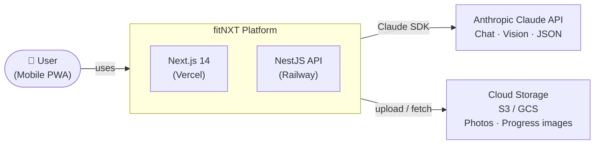
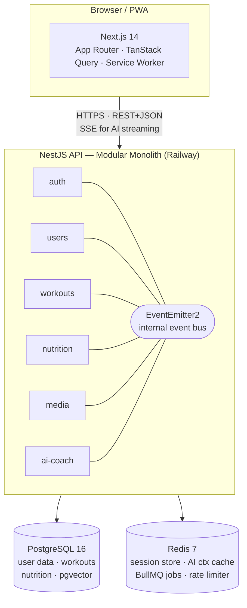
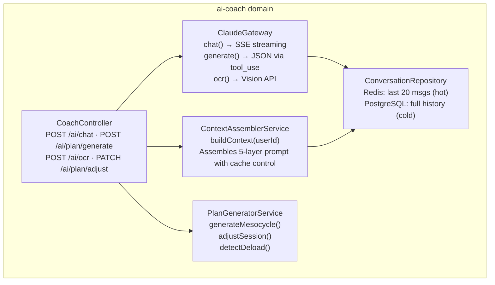
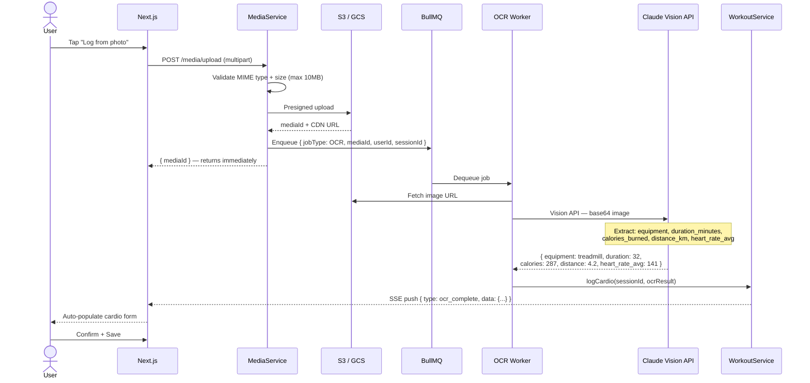
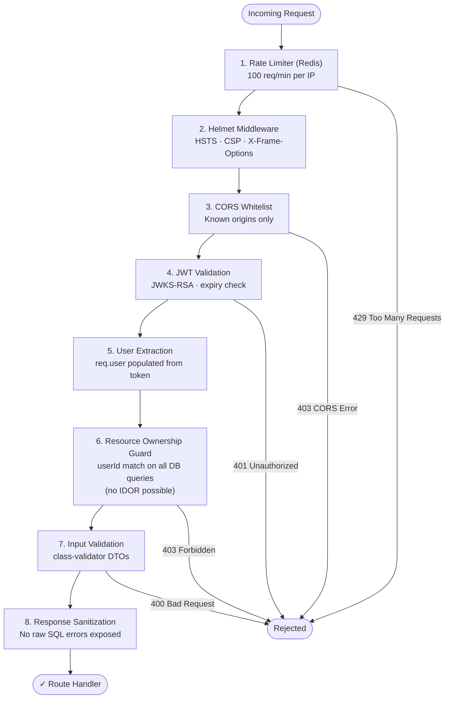

# Architecture — FitAI

## C4 Model

### Level 1 — System Context



### Level 2 — Container Diagram



### Level 3 — Domain Component: ai-coach



---

## Domain Boundaries

| Domain | Owns | Publishes Events | Consumes Events |
|---|---|---|---|
| `auth` | JWT tokens, OAuth sessions, refresh rotation | `user.registered` | — |
| `users` | Profile, goals, body metrics, BMI series | `user.goal_changed`, `user.weight_logged` | `user.registered` |
| `workouts` | Plans, mesocycles, sessions, exercise logs, PRs | `session.completed`, `pr.achieved` | `user.goal_changed` |
| `nutrition` | Meal logs, macro targets, food items | `nutrition.daily_summary` | `session.completed` |
| `ai-coach` | Conversations, generated plans, OCR results | — | all events (builds context) |
| `media` | S3 uploads, photo metadata, OCR queue | `media.ocr_ready` | — |

---

## Data Flow: Photo OCR Workout Log



---

## Scaling Strategy

### Phase 1: Single-user to ~100 users (current architecture, zero changes)

- Modular monolith on a single Cloud Run instance (min 1 instance, max 5)
- PostgreSQL on Supabase free tier (500MB) or Cloud SQL micro
- Redis on Upstash free tier (10K commands/day)
- Claude API: prompt caching reduces cost ~80% per user after first request

**Bottleneck at this scale:** none. A single Cloud Run instance handles 1,000+ concurrent requests easily.

### Phase 2: 100–10,000 users (extract hot domains)

- `ai-coach` extracted to its own service — it's stateless and CPU-bound on AI calls
- `media` extracted to its own service — independent scaling for OCR queue
- `auth` extracted — security isolation, can add WAF in front
- PostgreSQL read replica added for dashboard queries
- Redis cluster (or Upstash Redis paid tier)
- EventEmitter2 → replaced with Redis pub/sub (interface unchanged in other domains)

**Migration cost:** minimal. Because each domain already has clear interfaces, extraction is a deployment concern, not a code rewrite.

### Phase 3: 10,000+ users (full distribution)

- All domains become independent services behind an API gateway
- PostgreSQL → Citus (horizontal sharding by user_id)
- Redis → Redis Cluster
- BullMQ → SQS or Cloud Tasks
- pgvector enabled → semantic workout search, recommendation engine
- ML pipeline: workout_logs table → feature extraction → similarity model → "users like you increased bench by 15% faster with this progression"

### Data Strategy for Future ML

Every workout log is stored with full telemetry — not just "bench 80kg × 8" but:
```json
{
  "exercise_id": "bench-press",
  "sets": [
    { "reps": 8, "weight_kg": 80, "rpe": 7, "rest_seconds": 150, "logged_at": "..." },
    { "reps": 7, "weight_kg": 80, "rpe": 8.5, "rest_seconds": 180, "logged_at": "..." }
  ],
  "session_fatigue_score": 6.2,
  "days_since_last_session": 2,
  "sleep_hours": 7.5,     ← optional, user-provided
  "stress_level": 4       ← optional, user-provided
}
```

This schema is designed to be a training dataset. When you have 10,000 users logging 4 sessions/week, the dataset enables:
1. **Progression velocity prediction** — how fast will this user increase their squat given current trajectory?
2. **Recovery modeling** — optimal rest days per user based on their fatigue response pattern
3. **Plateau detection** — alert 2 weeks before a user's progress stalls, suggest program variation

---

## Event Architecture

Intra-domain communication uses NestJS's EventEmitter2 — a typed, in-process event bus. This is not Kafka. It is intentionally simple for Phase 1, with a clear extraction path.

```typescript
// workouts domain publishes
this.eventEmitter.emit('session.completed', {
  userId, sessionId, totalVolume, duration, exercises
} satisfies SessionCompletedEvent);

// nutrition domain consumes
@OnEvent('session.completed')
async handleSessionCompleted(event: SessionCompletedEvent) {
  // increase calorie target on training days
  await this.adjustDailyTarget(event.userId, event.totalVolume);
}

// ai-coach domain consumes
@OnEvent('session.completed')
async indexSessionForContext(event: SessionCompletedEvent) {
  // update Redis context cache for this user
  await this.contextCache.invalidate(event.userId, 'session-summary');
}
```

When extracting to microservices, only the EventEmitter is replaced with a message broker (Redis pub/sub or SQS). Event payload interfaces stay identical.

---

## Security Architecture



**AI-specific security:**
- User input to Claude is always passed as `user` role, never injected into the system prompt
- System prompt is server-side only, never exposed to client
- Media uploads: MIME type validated server-side (not just file extension), max 10MB, stored with UUID key (not original filename)
- Claude API key is never exposed to frontend — all Claude calls are server-side only

---

## Performance Targets

| Metric | Target | Strategy |
|---|---|---|
| API p95 latency (non-AI) | < 150ms | Redis caching, DB indexes |
| AI chat first token | < 800ms | Claude streaming SSE, prompt cache |
| Dashboard load (cold) | < 2s | Next.js RSC, static shell |
| Photo OCR turnaround | < 8s | BullMQ async, SSE notification |
| DB query p95 | < 20ms | Composite indexes, connection pooling |
