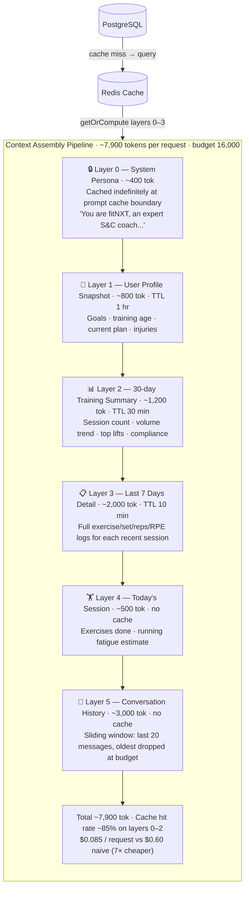

# System Design — FitAI

## Problem Statement

Design a fitness coaching system where an AI model (Claude) acts as a personal trainer. The system must:
1. Maintain per-user training context across sessions without sending full history on every request
2. Extract structured data from unstructured inputs (photos, natural language meal descriptions)
3. Generate and dynamically modify periodized training plans
4. Scale from 1 user to 100,000 users without architectural rewrites
5. Accumulate training data in a format usable for future ML models

---

## AI Context Management — The Core Engineering Problem

This is the most interesting technical problem in the system. A naive implementation breaks in two ways:

**Problem 1: Token explosion**
User has 6 months of training history. Naively including all conversations + all session logs exceeds 200k tokens per request. Cost: ~$0.60/request at Claude Sonnet pricing. At 10 req/day × 10,000 users = $22,000/day. Unacceptable.

**Problem 2: Stale context**
Cache the full context and it goes stale. User just logged a PR, asks "am I progressing?", AI says "you haven't hit a PR in 3 weeks." Trust broken.

**Solution: Layered differential context with semantic compression**



### Context assembly algorithm (pseudocode)

```
function buildContext(userId, sessionId?, conversationId?):
  BUDGET = 16_000 tokens

  // Parallel fetch all layers from Redis cache or DB
  [profile, summary, recent, session, history] = await parallel:
    cache.getOrCompute("user:{id}:ctx:profile", 3600s, buildProfileLayer)
    cache.getOrCompute("user:{id}:ctx:summary", 1800s, buildSummaryLayer)
    cache.getOrCompute("user:{id}:ctx:recent", 600s, buildRecentLayer)
    sessionId ? buildSessionLayer(sessionId) : null
    conversation.getRecent(conversationId, 20)

  // Check budget
  totalTokens = estimate(profile + summary + recent + session)

  if totalTokens > BUDGET * 0.7:
    // Compress Layer 3 via cheap Claude Haiku call
    recent = await compressWith(claudeHaiku, recent, targetTokens=1000)

  return assembleWithCacheControl([profile, summary, recent, session], history)
```

---

## Multi-User Scaling Analysis

### Bottleneck identification per scale tier

**0–100 users**
- Bottleneck: none
- Claude API concurrent request limit (default 50 requests/minute) easily handles this
- Single Cloud Run instance, single PostgreSQL instance

**100–1,000 users**
- Bottleneck: Claude API rate limits at peak hours (gym time = 6–8 AM, 6–9 PM)
- Solution: BullMQ queue with rate limiter (process max 40 Claude requests/minute)
- Non-blocking: user sees "Thinking..." with animated indicator, response arrives via SSE

**1,000–10,000 users**
- Bottleneck: PostgreSQL connection pool exhaustion (max ~100 connections on free tier)
- Solution: PgBouncer connection pooler (transaction mode, 1,000 app connections → 20 DB connections)
- Secondary bottleneck: Redis memory on free tier (10MB Upstash limit)
- Solution: Move to paid Redis ($10/month Upstash pay-as-you-go)

**10,000–100,000 users**
- Bottleneck: Single PostgreSQL instance for write-heavy set_logs table
- Solution: PostgreSQL read replica for dashboard queries; shard set_logs by user_id range
- Claude API: switch to Anthropic Batch API for non-real-time operations (plan generation, daily summaries) — 50% cost reduction

---

## Data Strategy for Future ML

Every data point captured is designed for ML training. The schema is intentional:

### Training dataset structure

```
set_logs table → ML feature vector per set:

Features (inputs):
  - exercise_id (categorical)
  - user.training_age_months (continuous)
  - user.body_weight_kg (continuous)
  - days_since_last_training_this_muscle (continuous)
  - session_number_in_mesocycle (continuous)
  - week_number_in_mesocycle (continuous)
  - previous_session_volume_for_exercise (continuous)
  - rpe_actual (continuous)
  - sleep_hours_last_night (optional continuous)
  - session_fatigue_at_time (continuous, derived)

Labels (outputs):
  - reps_achieved (regression target)
  - weight_achieved (regression target)
  - days_to_next_pr (survival analysis target)
  - session_will_be_completed (binary classification)
```

### Phase 2 ML models (when you have >1,000 users × >6 months data)

**Model 1: Progression predictor**
"Given this user's history and today's session, what weight will they achieve for set 3 of bench press?"
Use: auto-fill weight suggestions more accurately than "add 2.5kg/week" heuristics.

**Model 2: Recovery classifier**
"Is this user recovered enough to train at full intensity today?"
Features: sleep, HRV (if available), days since last session, recent RPE scores.
Use: recommend rest day or modified session.

**Model 3: Similar user clustering (pgvector)**
```sql
-- Store user fitness profile as embedding vector
UPDATE user_fitness_profiles
SET profile_embedding = $1      -- 768-dimensional vector
WHERE user_id = $2;

-- Find similar users for "people like you progressed faster with..."
SELECT user_id, profile_embedding <=> $1 AS similarity_distance
FROM user_fitness_profiles
ORDER BY similarity_distance
LIMIT 10;
```
Use: "Users with your training profile who added a second leg day saw 20% faster quad development."

### Data retention for ML

Set logs are **permanent**. Even deleted users have anonymized set logs retained (GDPR: data is anonymized, not deleted). This ensures the dataset doesn't shrink when users churn.

Anonymization on account deletion:
```sql
UPDATE users SET email = 'deleted_' || id, password_hash = NULL, deleted_at = now()
WHERE id = $1;
-- set_logs, body_metrics, meal_logs remain linked to user_id
-- user_id is a UUID with no PII — safe to retain
```

---

## Security Threat Model

| Threat | Mitigation |
|---|---|
| Prompt injection via user input | User messages always in `user` role, never interpolated into system prompt |
| IDOR (user A reads user B's data) | All queries include `WHERE user_id = req.user.id` — no global IDs exposed |
| Photo upload abuse (non-gym content) | MIME type validation + size limit + Claude Vision rejects non-machine-display images with 400 |
| JWT secret compromise | JWT expires 15min; refresh token rotation on every use |
| Rate limit abuse | Sliding window per IP + per user; BullMQ queue prevents Claude API flooding |
| API key exposure | API keys in GCP Secret Manager only; never in logs, env files, or client bundle |
| SQL injection | Kysely parameterized queries; no string concatenation in SQL |

---

## Observability Stack

```
Instrumentation:
  OpenTelemetry SDK → traces every request + DB query + Claude API call
  Winston → structured JSON logs with requestId correlation
  Prometheus → metrics scraping

Tracing propagation:
  Next.js → HTTPS → NestJS → PostgreSQL
                           → Redis
                           → Anthropic API
  All spans linked by trace-id header

Key traces to capture:
  1. POST /ai/chat
     - contextAssembly (how long to build context)
     - cacheHit/cacheMiss per layer
     - claudeApiCall (ttft = time to first token)
     - totalTokensUsed

  2. POST /media/upload + OCR job
     - uploadToStorage
     - ocrJobEnqueue
     - claudeVisionCall
     - resultParsed

  3. GET /workouts/dashboard
     - dbQueryDuration (should be <20ms with indexes)
     - cacheHit for summary data
```

---

## API Versioning and Backward Compatibility

URL-based versioning: `/v1/`, `/v2/`

Rules:
1. New fields in responses are non-breaking — add freely
2. Removing or renaming fields = breaking change = new version
3. `/v1/` maintained for 12 months after `/v2/` launch
4. Deprecation communicated via `Sunset` response header: `Sunset: Sat, 1 Jan 2027 00:00:00 GMT`

Since this is a first-party API (we own all clients), this is less critical than a public API — but the discipline signals maturity in the codebase.
